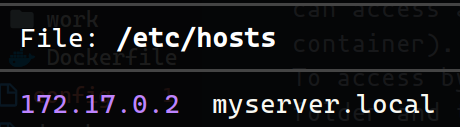

# Go REST API with Gin and JWT (Modified for P4)

This project implements a Go-based REST API for user management and document handling using the Gin framework. It includes user authentication, user creation, document retrieval, creation, update, and deletion.

With the new features, the API is now running into several containers with Docker where the services are connected by a container called "Router" that is the one that exposes the API to the outside. The containers are:

*Router* *Jump* *Broker* *Auth* *Files* *Work*

In this new modified version, the API is divided into three services, where broker redirects the requests to the corresponding service through the router. This is achieved thanks to the firewall that is implemented through some iptables in each container.

In this new version we can also access the containers through ssh. We have two users: op (who can access all the containers with sudo privileges) and dev (who can only access the work container). We can only access the containers through some jumps following a certain jump flow. We'll use jump->work->any_container and to enter work we use only jump->work. To access by ssh in a easier way we can add the [config](P4/docker-ssh/demo-ssh/config) file to our .ssh folder and then we can access the containers using ssh + the host name used in the config file. For example, to access the work container as dev we can use *work-as-dev*.


## Endpoints

Endpoints stay the same as in the original version, we only change the url or add it to our /etc/hosts file: 


The url should be *https://myserver.local:5000*.

1. **Get API Version**
   - Method: `GET`
   - Path: `/version`
   Returns the API version.

2. **Sign Up New User**
   - Method: `POST`
   - Path: `/signup`
   - Request Body:

     ```json
     {
       "username": "newUser",
       "password": "newPassword"
     }
     ```

     Post a new user with the given username and password. The password will be hashed and stored in the `users.json` file.
     Returns a JWT token for the new user.

3. **Log In**
   - Method: `POST`
   - Path: `/login`
   - Request Body:

     ```json
     {
       "username": "existingUser",
       "password": "existingPassword"
     }
     ```

      Returns a JWT token for the existing user.

4. **Get Documents Associated with a User**
   - Method: `GET`
   - Path: `/:username/:doc_id`
   - Authorization Header: `Authorization: token <token>`
   Returns the raw content of the document with the given ID associated with the given user.

5. **Add New Document**
   - Method: `POST`
   - Path: `/:username/:doc_id`
   - Authorization Header: `Authorization: token <token>`
   - Request Body:

   ```json
     {
       "doc_content": "This is the content of the document."
     }
     ```

   Creates a new document with the given ID associated with the given user.

6. **Update Document**
   - Method: `PUT`
   - Path: `/:username/:doc_id`
   - Authorization Header: `Authorization: token <token>`
   - Request Body:

   ```json
     {
       "doc_content": "This is the updated content of the document."
     }
     ```

   Updates the document with the given ID associated with the given user.

7. **Delete Document**
   - Method: `DELETE`
   - Path: `/:username/:doc_id`
   - Authorization Header: `Authorization: token <token>`
   Deletes the document with the given ID associated with the given user.

## Configuration and Execution

**How to start the API?**

To configure and start the containers and the api is very simple. We have a [Makefile](P4/docker-ssh/demo-ssh/Makefile) with several options. To build and run the containers we use *make run containers* and to stop and delete them we use *make remove && make clean*. The API will start automatically. We can also run some tests using *make run_tests*.


